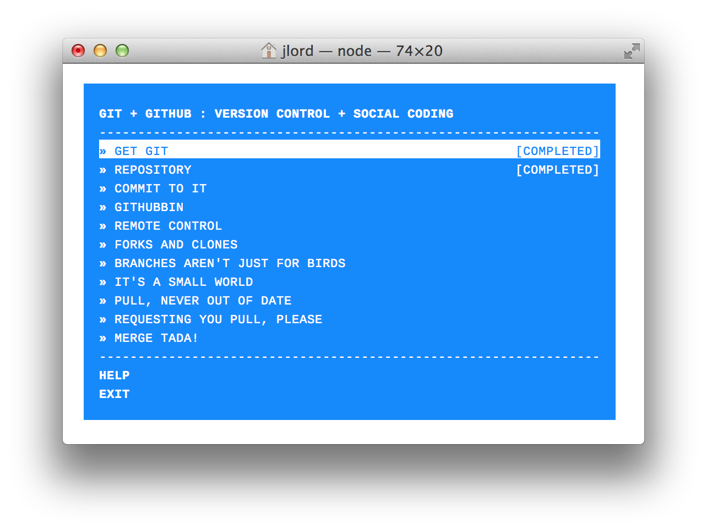

git-it [WIP]
======

A [workshopper](https://github.com/rvagg/workshopper) module for learning Git and GitHub - Social coding, y'all.

## The Rough Plan

This workshopper takes workshoppees on a journey through Git and GitHub (and with all that, a little basic command line, too):

- Install and configure git
- Create repository
 - mkdir, git init
- Add file to repository
- Check in
 - git status, add, commit, push
- Fork
- Clone
- Add upstream
- Pull changes 
- Create branch
- edit file
- Check in
- Submit a PR

#### Exciting Repo-Bot Future

I also intend on building a bot that listens to events on a repo (the one given as the repo to fork in this workshop) so that workshoppes can do things like pull in changes, or possible handle a merge conflict! Eek!

##### Other Things

I want to throw in GitHub Pages into this, too, because it's so great. How nice to end up with your own website at the end of this workshop?

_notes to self_
- add intro to terminal/bash/shell
- something about text editors
- be prescriptive about folder/file names and content?
- add git diff